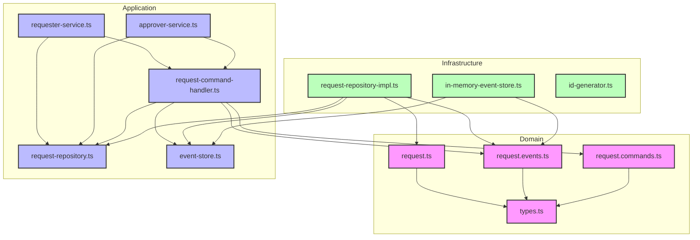

# lab

To install dependencies:

```bash
pnpm install
```

To run:

```bash
pnpm run dev
```

## アーキテクチャ概要

本プロジェクトは、クリーンアーキテクチャや DDD（ドメイン駆動設計）の考え方を参考に、以下の 3 層構造で設計されています。

### 1. domain 層（ドメイン層）

- ビジネスロジックの中心となる型定義やエンティティ、ドメインサービスを定義します。
- 例: `RequestType`, `PendingRequest`, `ApprovedRequest` などのリクエスト型、`isPendingRequest` などのタイプガード関数。
- コマンド（`request-commands.ts`）、イベント（`request-events.ts`）、基本型（`types.ts`）もここに含まれます。

### 2. application 層（アプリケーション層）

- ユースケースやアプリケーションサービス、コマンドハンドラ、リポジトリインターフェースを定義します。
- 例:
  - サービス: `ApproverServiceImpl`, `RequesterServiceImpl`
  - ハンドラ: `RequestCommandHandler`
  - リポジトリインターフェース: `RequestRepository`
- ドメイン層の型やロジックを利用し、インフラ層に依存しない形でビジネスユースケースを実現します。

### 3. infrastrucutre 層（インフラ層）

- 実際のデータ保存や ID 生成など、外部システムとのやりとりを担当します。
- 例:
  - `RequestRepositoryImpl`（リクエストの永続化・キャッシュ管理）
  - `InMemoryEventStore`（イベントストアのインメモリ実装）
  - `id-genenrator.ts`（UUID やタイムスタンプ生成のユーティリティ）

### 4. エントリーポイント

- `src/index.ts` では、各層の実装を組み合わせて実際のユースケース（例: 申請作成、承認、却下、キャンセルなど）を実行する例が記載されています。

---

## ディレクトリ構成

```

src/
├── domain/
│ ├── types.ts # 基本的な型定義（UUID, UserID, Timestamp）
│ ├── request.ts # リクエストエンティティとその状態定義
│ ├── request.events.ts # リクエスト関連のドメインイベント定義
│ └── request.commands.ts # リクエスト関連のコマンド定義
│
├── application/
│ ├── services/
│ │ ├── requester-service.ts # 申請者向けサービス
│ │ └── approver-service.ts # 承認者向けサービス
│ ├── handlers/
│ │ └── request-command-handler.ts # コマンドハンドラ
│ └── repositories/
│ ├── event-store.ts # イベントストアインターフェース
│ └── request-repository.ts # リクエストリポジトリインターフェース
│
├── infrastructure/
│ ├── request-repository-impl.ts # リクエストリポジトリの実装
│ ├── in-memory-event-store.ts # インメモリイベントストアの実装
│ └── id-generator.ts # ID生成ユーティリティ
│
└── index.ts # アプリケーションのエントリーポイント
```

---

## 各層の依存関係

- domain 層は他層に依存しません。
- application 層は domain 層に依存しますが、infrastructure 層には依存しません（インターフェース経由）。
- infrastructure 層は domain 層・application 層のインターフェースを実装します。

#### 依存関係図



---

この構成により、ビジネスロジックとインフラの分離、テスト容易性、拡張性を高めています。
